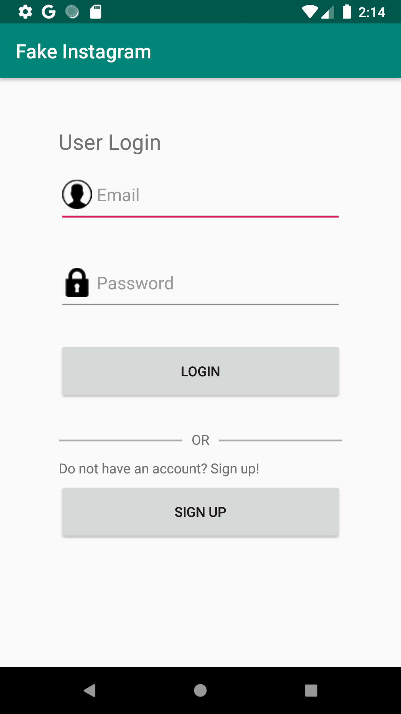
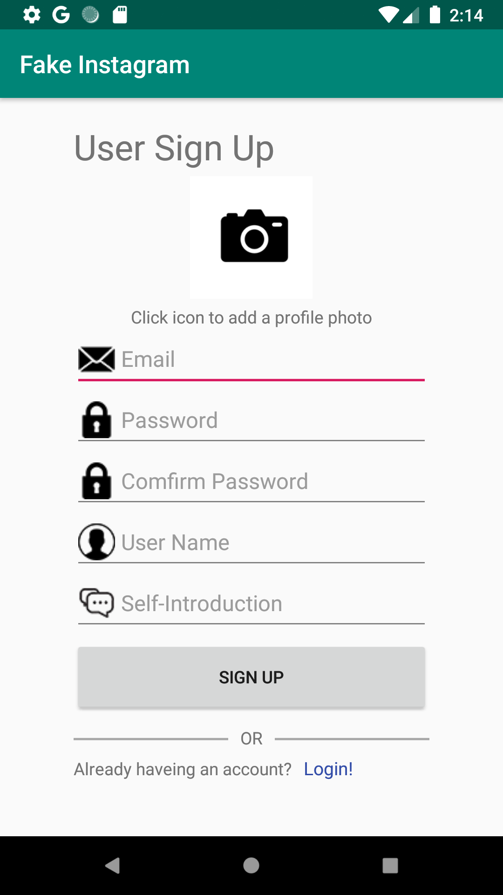
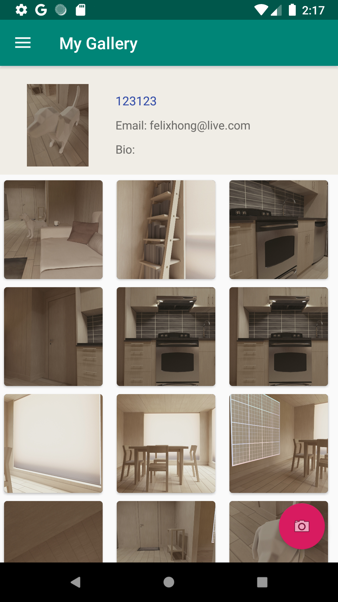

# simple-Instagram-android-app
Individual project from course "Creative Mobile Applications". The goal of this project is to create an Android app similar to "Instagram": a picture sharing app that allows users to register and then take and upload pictures, all of which are shared with other users of the app.

## Tested Working Virtual Device:
- Nexus 5X API 27 2

